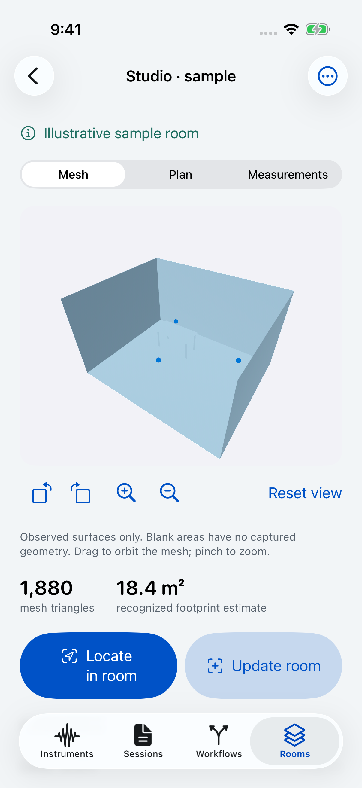
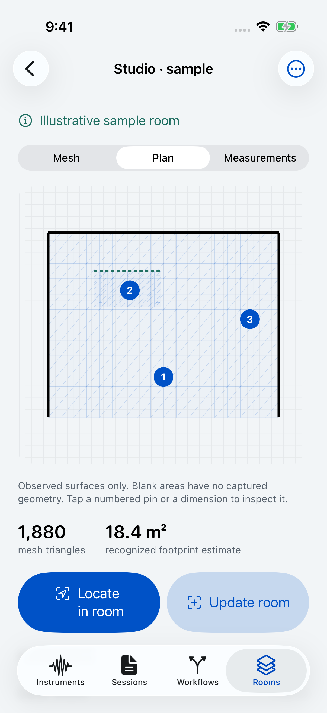

# Rooms and field instruments

Implementation and validation record, September 10, 2026. Branch: `codex/room-instruments`. This implements the selected Room canvas and all 18 capability paths from [the research](INSTRUMENT_CAPTURE_RESEARCH.md), including locating a user within a saved space and retaining measurement positions. Device-dependent acceptance is listed separately below.

## Using the feature

Open **Rooms → Capture a room** on a LiDAR device. Scan visible surfaces, finish, review the mesh, name the room, and save. **Mesh**, **Plan**, and **Measurements** share dimension/component selection. Orbit, zoom, and reset have button equivalents. The plan opens measurement pins; the measurement list provides the same destinations without spatial gestures. Native sample rooms used in UI tests are explicitly marked illustrative.

Use **Locate in room** to attempt restoration of that revision's saved AR world map. Match the reference photo and move slowly. Once tracking is reliable, choose **Use this orientation**, then open another instrument. The camera remains active and a visible orientation banner provides an **End room orientation** action. New readings keep the room, revision, coordinate frame, position, orientation, observation time, and placement method. Tracking loss clears usable position/depth instead of carrying a stale pose forward. Backgrounding ends orientation.

A capture can also be placed manually: choose **Place in a room**, tap the plan or enter coordinates, set orientation, and add a note. The UI identifies manual placement. It never assigns the current tracked pose to an older reading as though it had been measured there. Scalar recordings preserve per-sample positions through save/reopen and JSON/CSV export. The room plan displays observed positions without interpolating an RF heatmap.

**Update room** creates another immutable revision. Successful map restoration keeps a common coordinate frame; **Capture a separate pass** uses a new frame while retaining room history. Comparison uses the same plan scale for aligned revisions and separate plans when alignment is absent. Only the new pass's observed mesh is saved. Missing geometry is not classified as a removed object, and passes are not fused into a supposedly current consolidated mesh.

**Instruments → Field tools** opens NFC, network, cellular, LiDAR, and participating-device tools. Each produces an inspectable capture in **Sessions** and uses the same placement, comparison, and export flow where applicable.

## Capability and evidence matrix

“Implemented” means the public API, saved representation, and UI path are present and compile for simulator and device. It is not a claim of physical accuracy or hardware acceptance.

| Selected capability | Implemented behavior | Current evidence / remaining acceptance |
| --- | --- | --- |
| 1. NFC identity | Protocol-specific identifier; manufacturer code only when reported; unavailable fields omitted | Raw-record/decoder tests; unsupported-device UI. Real tag matrix remains |
| 2. NFC contents | Text/URL decoding, deliberate URL open, raw fields, record-by-record comparison | Unknown/malformed payload preservation tested. Real multi-record tags remain |
| 3. NFC storage | NDEF capacity, encoded message size, remaining allocation, read-only/read-write/unsupported status | Native inspector; physical capacity/read-only cases remain |
| 4. NFC diagnostics | Monotonic command durations, reader activation, cancellation/failure diagnostics; save attempt without tag contents | Simulator unsupported attempt path; physical cancellation, loss, and timeout remain |
| 5. Cellular technology | Per-service reported registration, timestamped change observations, save/review | Public Core Telephony path; unavailable state exercised. Physical dual-service/change behavior remains |
| 6. Cellular performance | Actual URLSession transaction route verification; noncellular/cache transactions excluded from cellular timing statistics | Mixed/failing/cached transaction tests. A real route-verified cellular transfer remains |
| 7. Service forecasts | WirelessInsights stream, issued time, predicted intervals, impact/confidence, no-data/error states | Signed app/profile carry the entitlement. Actual device response/payload remains |
| 8. Reception history | Delayed MetricKit cellular histogram, collection/arrival dates, per-installation deduplicated local capture | Source and bounded model validation; actual delivered MetricKit payload remains |
| 9. Request phases | Per-request transactions, DNS/connect/TLS/send/wait/receive waterfall, protocol/reuse/cache context | Real local HTTP fixture exercises reuse, HEAD, GET byte limits, POST bytes, errors, redirects, cancellation; TLS nesting test |
| 10. Consistency | Successful median/p95/maximum, p95-minus-median variation, failure denominator, separate failure timeline, request picker | Statistics and real request tests; no zero-latency substitutions for failures |
| 11. Local peer performance | Bonjour discovery, verified ephemeral encrypted connection, 20 echo requests, 2 MiB each way, SHA-256 validation | Two simulator apps completed all 20 echoes and 4 MiB; production-controller discovery/stop/restart/disconnect test passes. Physical LAN cases remain |
| 12. Paired-device radio quality | Wi-Fi Aware system pairing/discovery, optional link reports with timestamps and individually named measured/estimated fields | Signed app/profile includes Publish/Subscribe. Two compatible physical devices and optional-report cases remain |
| 13. Nearby distance/direction | Nearby Interaction tokens over confirmed encrypted peer link; distance, optional phone-relative bearing; stale values expire | Source/lifecycle path compiled; two compatible physical devices remain |
| 14. Distance/clearance | Camera-to-reticle depth estimate, baseline delta, retained camera/hit position and confidence | Geometry/depth model tests; tape references and difficult surfaces remain |
| 15. Width/height/separation | Two selected depth endpoints, camera endpoint/line overlay, Undo, saved dimensions and room ownership | Endpoint/frame persistence tests; physical endpoint/measurement checks remain |
| 16. Surface orientation/shape | Raw-depth patch, PCA plane, angle from horizontal, RMS/residual span, retained points and residual plot | Horizontal/vertical/tilted/noisy/degenerate plane tests. External level/flatness comparisons remain |
| 17. Depth/confidence | Retained depth grid with intrinsics, cividis meter scale, clipping count, separate categorical confidence, pixel inspection | Bounds/serialization tests and native renderer. Physical scene-depth capture remains |
| 18. Room geometry | Observed ARKit mesh, RoomPlan components, validated footprint estimate, explicitly qualified height-extruded volume, immutable revisits, archive/OBJ/semantic USDZ/CSV | Offline persistence, sibling revisions, corrupt recovery, geometry validation and export tests. Physical capture/revisit/change/alignment/performance matrix remains |

## Persistence and portability

- Room source geometry is immutable after save. A new pass gets a new revision ID. Index publication and payload writing use the existing coordinated atomic archive transaction with rollback.
- Recovery checkpoints retain partial observed meshes. One unreadable recovery file does not hide readable drafts or the saved library. It remains on disk; deletion/pruning conservatively preserves possible spatial references until the user discards the unreadable file.
- Deletion protects references from captures, per-sample recording positions, calibration profiles, child revisions, and unfinished work. Remote tombstones preserve referenced source bytes until references are detached.
- Room captures include optional OS/app/device-family/configuration provenance and bounded tracking-state changes. No precision certificate is inferred from tracking state or a confidence category.
- Existing library/recording JSON without room fields remains decodable. New CloudKit record kinds use the existing generic CKAsset transport and per-installation opt-in. Payloads are materialized one at a time for upload preparation. Older clients that do not understand the new record kinds will pause on them; update participating installations together.
- Local save success is independent of iCloud success. Real cross-device CloudKit transfer of large room assets has not been accepted in this change. Source-level two-writer synchronization/conflict tests are not hosted CloudKit proof.

## Export contract

| Format | Included | Limits |
| --- | --- | --- |
| Room archive JSON | One complete room revision, source mesh/transforms/classes, recognized model data, dimensions, optional world map/reference image/provenance | Reimport validates geometry and revision identity. Other revisions and separately saved field captures are not included. Maximum accepted import is 384 MiB |
| Observed mesh OBJ | All retained surface vertices/faces transformed into that revision's frame; meter units and frame ID in header | No semantic model, world map, color texture, or attached captures |
| Recognized-room USDZ | RoomPlan's mesh export of its recognized room | Offered only with RoomPlan data. This is not the detailed observed ARKit mesh or a resumable archive |
| Room measurements CSV | Dimensions, units, method, revision and coordinate frame | A measurement table, not a geometry archive |
| Field capture JSON / CSV | JSON retains full source evidence; CSV exports measured rows and associated positions | NFC raw records and complex depth/mesh payloads require JSON. Spreadsheet formula prefixes are escaped |
| Existing recording JSON / CSV | Original readings plus optional per-reading room/revision/frame/pose/method/time | No corresponding room geometry embedded |

## Validation performed

- Simulator Debug, signed physical-device Debug, and unsigned physical-device Release builds pass with Swift and compiler warnings treated as errors. The Release build keeps development access and room fixtures disabled.
- 68 software tests pass, including 16 room tests and 5 network/peer tests, plus the existing archive, instrument, capture, live-activity, portability and report suites.
- The real HTTP fixture covers persistent connection reuse, an error response, a rejected redirect, HEAD semantics, bounded GET, actual 2 MiB POST bytes, prompt cancellation and query redaction.
- The production peer-controller test discovers its host with Bonjour, compares connection codes, confirms both sides, immediately cancels/restarts, verifies 20 echo observations and both transfers, and checks that disconnect preserves the completed result. A separate two-app simulator run also completed the visible flow.
- Six iPhone UI tests pass: room mesh/plan/selection, aligned revision comparison, archive preparation, manual location save/relaunch, unsupported capture and saved NFC diagnostics, largest accessibility text, light/dark contrast and field-tool readiness.
- iPad room flow, largest accessibility text, and dark-mode contrast audits pass across three tests.
- A rollback test forces an index commit failure after payload writing, then verifies that new room bytes are removed, edited capture bytes are restored, and the recovery draft and original index are retained.
- Apple-issued development signing profile and signed entitlements were inspected for NFC TAG, Wi-Fi Aware Publish/Subscribe, and WirelessInsights service predictions. Provisioning is not device-runtime acceptance.

The unchanged purchase tests are excluded from this focused run. The repository's [existing StoreKit validation record](PRO_VALIDATION.md) documents its dedicated scheme/Xcode setup requirements. This change does not claim a new StoreKit acceptance run. The command-line test build suppresses the StoreKitTest SDK's deprecated Objective-C import warning; application Swift warnings remain errors.

## Physical acceptance and release status

The signed app was successfully installed on the connected iPhone. Xcode's test launch reported **Unlock Brads iPhone to Continue**. A bounded physical test is prepared to capture, save in an isolated test library, terminate, relaunch and reopen actual geometry. No physical room scan, real tag read, cellular route test, WirelessInsights payload, MetricKit payload, Wi-Fi Aware transfer or UWB range is claimed until actual outputs are obtained.

Before release, perform the physical matrix in [the room specification](ROOM_CAPTURE_SPEC.md) and [the research acceptance table](INSTRUMENT_CAPTURE_RESEARCH.md#implementation-order-and-acceptance): changed-light/changed-room revisits, failed restoration, tracking loss, source retention after interruption, actual export/import, external dimension/level references, difficult surfaces, oldest supported LiDAR performance, two compatible peers, disconnect/reconnect, and optional/missing provider data.

The current volume is explicitly a recognized-footprint times consistent wall-height estimate. It does not measure ceiling shape or unidentified floor voids. A complete physical volume or authoritative building-area claim is outside the available evidence.

No merge, TestFlight upload, App Store submission, or production deployment is part of this implementation delivery. The repository privacy page now describes the actual storage, optional CloudKit sync, endpoints, peer traffic, camera assets, and exports. Before release, reconcile the separately hosted policy linked by the app (`bradzellman.com/magiccuts-policies.html#privacy`) and App Store privacy disclosures; this change does not publish that external policy.

## Native screenshots and test artifacts

These images are captured from the running simulator app. The room/readings fixture is explicitly illustrative. The peer result is actual traffic between two simulator processes; its throughput is not a physical radio benchmark.

| Room canvas | Plan and selection |
| --- | --- |
|  |  |

[Dark mode](screenshots/room-instruments/room-mesh-dark.png), [iPad](screenshots/room-instruments/room-ipad-dark.png), [largest accessibility text](screenshots/room-instruments/room-largest-text.png), [saved placement reopened](screenshots/room-instruments/reading-position-reopened.png), [revision comparison](screenshots/room-instruments/room-revision-comparison.png), [archive export](screenshots/room-instruments/room-export-archive.png), [actual simulator peer transfer](screenshots/room-instruments/peer-simulator-transfer.png).

Local XCTest result bundles from this implementation run:

- `/tmp/magiccuts-room-instruments/final-phone-complete.xcresult`: 68 software tests and six iPhone UI tests passed.
- `/tmp/magiccuts-room-instruments/review-final.xcresult`: 16 room tests and the main room UI flow rerun after final lifecycle guards and contextual plan instructions.
- `/tmp/magiccuts-room-instruments/final-ipad-b.xcresult`: room flow and largest-text tests passed; the dark badge contrast failure was fixed and rerun successfully in `final-ipad-c.xcresult`.
- `/tmp/magiccuts-room-instruments/build-device-review-final.log`: final signed device build.
- `/tmp/magiccuts-room-instruments/build-release-review-final.log`: final unsigned Release build.
- `/tmp/magiccuts-room-instruments/physical-final.log`: physical test blocked before launch by Xcode's device-lock preflight; no scan attempted.

Reproduce the software and iPhone UI suite with a booted simulator ID substituted below:

```sh
xcodebuild -project MagicCuts.xcodeproj -scheme MagicCuts -configuration Debug \
  -destination 'platform=iOS Simulator,id=SIMULATOR_UUID' test \
  -only-testing:MagicCutsTests -skip-testing:MagicCutsTests/ProPurchaseTests \
  -only-testing:MagicCutsUITests/RoomFieldworkUITests \
  -skip-testing:MagicCutsUITests/RoomFieldworkUITests/testPhysicalRoomCaptureAndOfflineReopen \
  SWIFT_TREAT_WARNINGS_AS_ERRORS=YES GCC_TREAT_WARNINGS_AS_ERRORS=YES \
  'OTHER_SWIFT_FLAGS=$(inherited) -Xcc -Wno-deprecated-declarations'
```

These temporary artifacts are local evidence, not repository-hosted CI or physical hardware proof.
